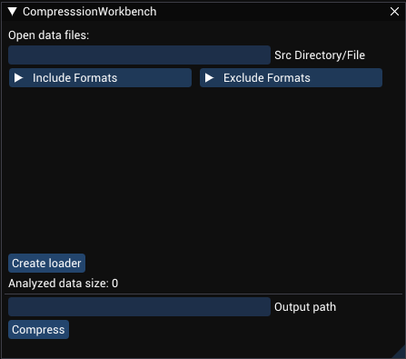
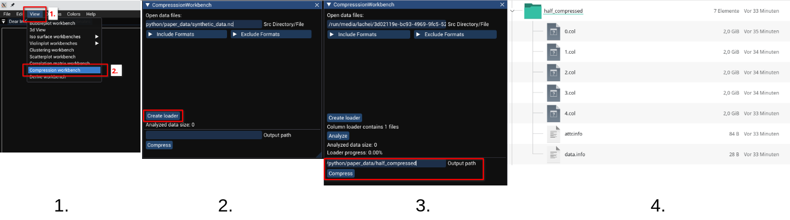
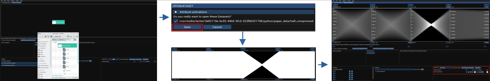
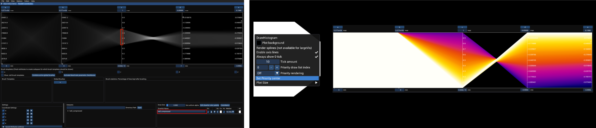

# Large Vis User Documentation

In order to use the PCViewer application for datasets with a size greater than 10 million dataponts it is recommended to use the **large vis** capabilities.

To visualize large datasets, you first have to convert your dataset to an interemediate representation. For this purpose there exists the **Compression Workbench** which can be found in the menu bar under the `View -> Compression workbench` menu item. Detailed explanation of this worbench can be found in the [Compression workbench section](#compression-workbench).

Then, after the conversion is complete, one can simply drag and drop the folder with the intermediate representation into the PCViewer application to visualize the data. Details on this can be found in the [Parallel coordinates visualization section](#parallel-coordinates-visualization).

For a walkthrough on a synthetic dataset which can be retrieved on (enter web address) see the [section on synthetic dataset demonstration](#synthetic-dataset-demonstration). The synthetic dataset is available at this [link](https://syncandshare.lrz.de/getlink/fi9rRF4sa5ypy48qQ9Prd6/).

## Compression Workbench
The compression workbench makes it possible to convert a dataset to the intermediate format needed for visualization.

The workbench can be opened via the main menu bar under `View -> Compression workbench`and looks like this:

Explanation of the UI elements:
- `Src Directory/File` : Text input field to input the folder with source files or a single source file. If the source path is a folder, also all subfolders are searched for data files.
- `Include Formats` : Collapsable menu to add regular expressions describing filenames/folder names that should be included for data conversion (to subselect files in a folder of files). Regular expressions have to follow the [ECMAScript syntax](https://cplusplus.com/reference/regex/ECMAScript/).
- `Exclude Formats` : Collapsable menu to add regular expressions describing filenames/folder names that should not be included for data conversion. For syntax for regular expressions see `Include Formats`.
- `Create loader` : Button to create the file loader which considers the source directory/file and the include/exclude regular expressions. When being clicked and the loader was created shows the amount of files found.
- `Output path` : Text input for the output folder. This folder has to be already created! It is recommended to use a clean folder as output, as otherwise there might be problems.
- `Compress` : Starts the compression. Is only active when the `loader` has been created with `Create loader`.

After the compression is done you will finde an `attr.info`, a `data.info` and `${amt_of_attributes}` `.col` files.

## Parallel Coordinates Visualization
After the intermediate representation has been created the dataste can be opened by dragging the folder containing the intermediate data onto the PCViewer application.

Look at the console output to see the loading status.

After loading is complete the data is processed in a backing thread and rendered when ready. Currently only polyline parallel coordinates drawing is available, however we are working on extensions to also provide a spline visualization.

Interactions with the parallel coordinates plot are the same as for standard parallel coordinates plotting and can be seen [here](/doc/pcp.md). The following interactions are currently also available for large vis pcps:
- axis rescaling
- axis reordering
- plot recoloring
- brushing (local and global brushes)
- priority rendering

## Synthetic Dataset Demonstration
Here a full example of the all steps needed for visualizing a dataset shall be shown.
For the provided example 10 GBytes of free RAM is needed. The more GPU memory is available the shorter the update times will be. On our test system with a NVIDIA RTX 3090 the update time is 300 ms for brush updates, and less for axis rescaling, axis reordering and plot recoloring.

The synthetic data comprising 5 variables and 2³⁰ datapoints for the following example can be found [here](https://syncandshare.lrz.de/getlink/fi9rRF4sa5ypy48qQ9Prd6/). The 5 variables are the letters **a** to **e** where for variable **a** and **b** each axis value of **a** is connected to each axis value of **b**. **c** has a random value for each datapoint, **d** is the value of **c** negated with added noise and **e** has the values of **c** with noise added.

The online storage contains a zip file containing a netCDF file containing all datapoints and additionally the intermediate representation for convenience. The time needed to create the intermediate data from the netCDF file is less than 5 minutes (conversion running on a single pc thread).

### Creation of the intermediate data

1. Open the compression workbench via the menu bar
2. Insert the file path to the `synthetic_data.nc` file and press `Create loader`
3. Below the `Create loader` button an information showing the amount of files found (When you input a folder this might contain multiple files). A new button `Analyze` appears which can be used to analyize the data for data size and attribute bounds (Is also done automatically when pressing `Compresse`). Then insert the output folder where the resulting intermediate files should be put. Finally press `Compress` for compressing. Compression is done on an extra thread. When done `Compression done!` will be written on the console.
4. Resulting folder/file structure

### Visualization

To visualize The converted data simply drag and drop the folder with the intermediate files into the PCViewer application and press `Open` in the popup. After a short loading time (for SataIII this should be around 30 seconds) a first visualization should appear. To adjust the visuals use the `Drawlist settings` in the right lower corner indicated by the red box in the figure above. To lower the alpha value of the color to very small numbers, after clicking on the color field double click on the `A` field and type in the alpha value you want. The image you can see in the figure above was taken with an alpha value of 0.0000001.

To add a brush like in the left window in the above figure, click on the drawlist `half_compressed` in the `Draw lists` section. When a drawlist is sselected it has a blue background. If you now move the mouse over the axes in the plotting area the mouse pointer changes to a hand. When that happens simply drag open a new brush. When the mouse is realeased the brush is applied and the data is reduced to contain only datapoints which are in the selected brush range. It is possible to add multiple brush ranges on a single axis as well as on multiple different axes. For more information on brushing see [the brushing section in the pcp doc](pcp.md#brushes).

To use priority rendering right click on the plot and select `Set Priority center`. After this click on an axis at a position where you want the priority center set. In the figure above the priority center was set on attribute **e** at the top which causes datapoints which are close to the priority center be drawn in front and in white, while datapoints farther away from the priority center are being colored orange/magenta/blue and are drawn in the back. Note that you might have to increase the alpha value again. To disable Priority rendering, select `None` in the dropdown menu `Priority rendering` above the `Set Priority center` menu item.